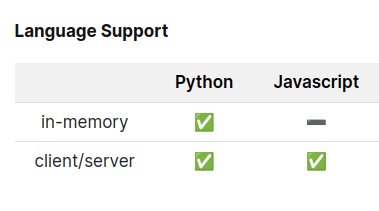

# Chroma 🌈🦜

Chroma is a database for building AI applications with embeddings. 

---

## Language support:



- To use Client/server in javascript:

    - `chromadb` gives access to the Chroma client.

    - We need to connect to chroma's backend.

---


## To connect to Chroma's backend

- you either need to connect to a hosted version of Chroma, or run it on your local computer.

- If you can run **`docker-compose up -d --build`** you can run Chroma:

```bash
git clone git@github.com:chroma-core/chroma.git
cd chroma
docker-compose up -d --build
```

<div align="center">== X ==</div>